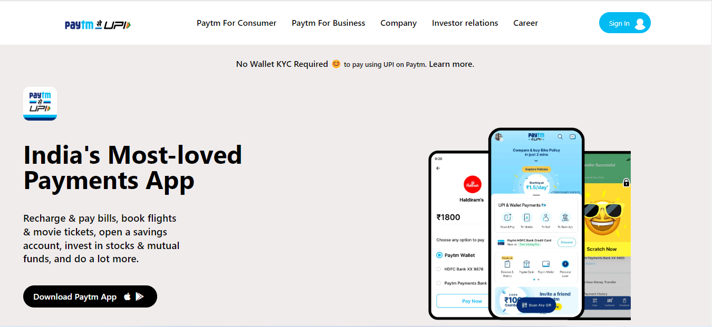

## My Name is Ajay.
## Project 15 from web dev bootcamp - Ineuron
# [Live website Link](https://aj-paytm-clone.netlify.app/)
### Project 15 was to create the clone of Paytm website and to make it mobile responsive using just tailwind css. I learnt tailwind css on the go while creating this project and was able to clone paytm website exactly as it is and make it slightly better even by making the website mobile responsive. This was a proper challeneg, I have two more projects to make from tailwind css before moving on to JavaScript.

### Time Taken to complete the prject: 10 hours.

### Website Preview:-

